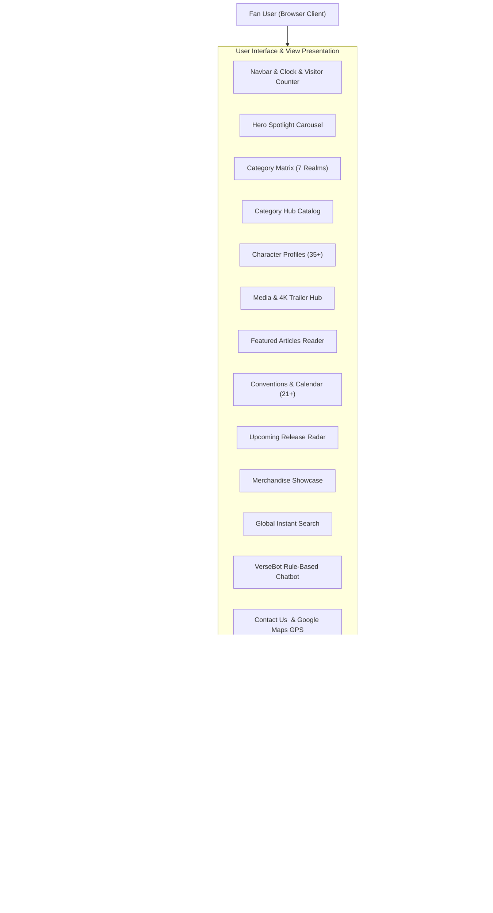
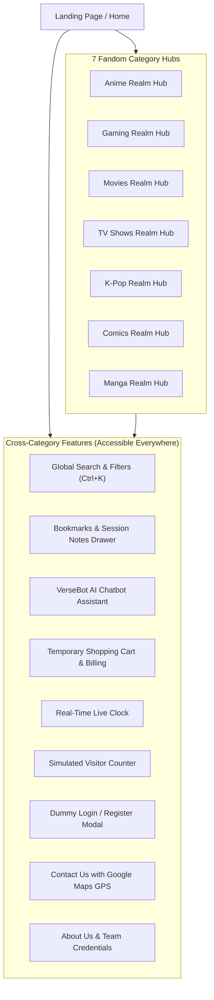
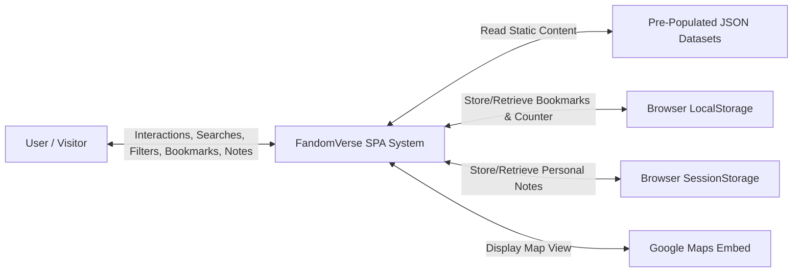
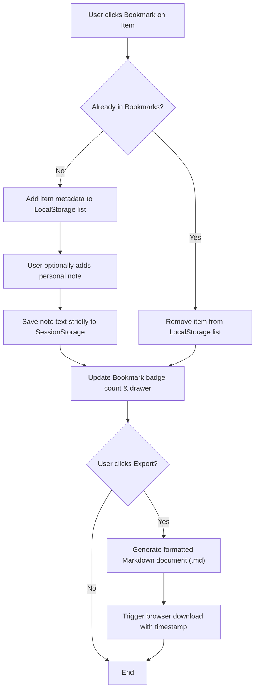
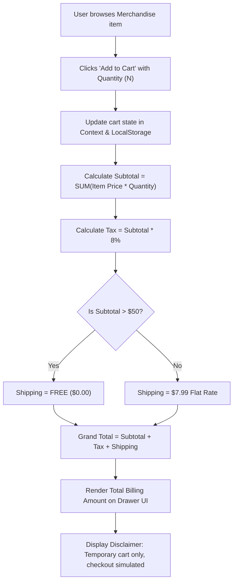

# FandomVerse — Portal for Fandom World
## Software Requirements Specification (SRS) Implementation & Project Report
**TechWiz 7 — The World  Tech Championship**  
**Thene:** Fandom Universe   
**Category:** Web Innovation Unleashed  
**Organizer:** Aptech Limited  
**Version:** 1.0.0  
** Architecture:** Single Page  Application (SPA) • 100% Client-Side • Responsive Design  

---

## 1. Problem Definition

In  the contemporary digital landscape, fandoms centered around Anime, Gaming, Movies, TV Shows, Korean-Pop (K-Pop), Comics, and Manga have grown into the most active, engaged, and passionate online communities. Fans worldwide consistently seek out character backstories, theatrical trailers, podcast analysis, upcoming conventions, release dates, and official fan merchandise.

However, existing fandom information remains intensely fragmented across disparate platforms:
- Character wikis and  lore portals
- Streaming networks and video  hosts
- Ticketing and  convention directories
- Scattered merchandise e-commerce storefronts
- Social media gossip feeds and music chart trackers

As a result, enthusiasts must navigate dozens of disjointed websites simply to stay updated on a single universe. Discovering new fandoms or cross-exploring related interests is equally cumbersome.

**FandomVerse** addresses this fragmentation by delivering a centralized, visually  captivating, media-rich Single Page Application (SPA). It unifies all seven major fandom categories into a responsive, intuitive, zero-backend platform that maximizes discovery, accessibility,  and  delight.

---

## 2. Design Specifications & Design System

### 2.1 Theme & Visual Identity
- **Design Metaphor:** Cyberpunk Galaxy / Neon Glassmorphism suited to modern media-rich fandom aesthetics.
- **Deep Space Palette:** Primary Background (`#090b13`), Card Backdrop (`rgba(18, 22, 38, 0.75)` with `backdrop-filter: blur(16px)`), Borders (`rgba(255, 255, 255, 0.1)`).
- **Thematic Category Color Tokens:**
  - **Anime:** Sakura Rose (`#f43f5e`)
 - **Gaming:** Cyber  Emerald (`#10b981`)
- **Movies:** Cinema Amber (`#f59e0b`)
- **TV Shows:**  Electric Indigo (`#6366f1`)
- **K-Pop:** Candy Magenta (`#ec4899`)
 - **Comics:** Comic Book Yellow (`#eab308`)
- **Manga:** Monochrome Violet (`#8b5cf6`)

### 2.2 Typography & Iconography
- **Typography:** Plus Jakarta Sans & Inter for clean, legible modern typography; Courier monospace for digital telemetry, timers, and the simuated  visitor counter.
- **Iconography :** Scalable, accessible SVG vector icons via Lucide React.

 ### 2.3 Responsive Breakpoints
- ** Mobile (< 640px):** Single-column layout, compact header, slide-out hamburger navigation drawer, touch-friendly tap targets.
- **Tablet (640px – 1024px):** Two-column card grids, responsive    toolbar controls.
-  **Desktop (> 1024px):** Four-column catalogs, persistent telemetry ticker , interactive modals, and floating assistants.

---

## 3. System Architecture &  Diagrams

### 3.1 Architectural Overview
FandomVerse is architected as an ultra-fast client-side Single Page Application (SPA). Per the strict constraints of SRS Section 1.5, **no server-side databases or backend servers are utilized**. All data is pre-populated in structured JSON data models and managed in memory with React Context and Web Storage APIs.



---

### 3.2 Site Map & Navigation Hierarchy



---

### 3.3 Data Flow Diagrams (DFD)

#### Level 0 DFD: Context Diagram


#### Level 1 DFD: Process Decomposition
```mermaid
flowchart TD
    User["User"] -->|Search Query & Filters| P1["1.0 Global Search Process"]
    P1 -->|Fetch Matching Records| DB1[("JSON Data Files")]
    P1 -->|Render Instant Results| User

    User -->|Toggle Bookmark| P2["2.0 Bookmark Manager"]
    P2 -->|Persist Item Details| DB2[("Browser LocalStorage")]
    
    User -->|Write Personal Note| P3["3.0 Session Note Handler"]
    P3 -->|Save Session-Only Note| DB3[("Browser SessionStorage")]

    User -->|Add Merchandise Item| P4["4.0 Temporary Cart Engine"]
    P4 -->|Calculate Subtotal, Tax 8%, Shipping| P4
    P4 -->|Display Billing Total (JS)| User

    User -->|Type Question / Select Prompt| P5["5.0 Rule-Based Chatbot Engine"]
    P5 -->|Query Knowledge Base| DB4[("FAQ Rules JSON")]
    P5 -->|Return Guidance & Page Link| User
```

---

### 3.4 Key Functional Activity Flowcharts

#### A. Content Bookmarking & Dual Storage Partitioning


#### B. Temporary Shopping Cart Billing Calculation


---

## 4. Test Data Catalogue

The application features comprehensive, rich, pre-populated test data in `src/data/`:

| Dataset File | Description | Minimum Requirement | Provided Count |
|  :--- | :--- | :--- | :--- |
| `categories.json` | 7 Core Fandom realms with color tokens and sub-tags | 7 categories | **7 fully configured realms** |
| `characters.json` | Dossiers with bios, abilities, power level, voice actors | At least 5 per category (35 total) | **35 comprehensive dossiers** |
| `events.json` | Global expos, conventions, watch parties, venue coordinates | At least 3 per category (21 total) | **21 global event listings** |
| `articles.json` | In-depth editorial pieces, read times, related story links | Multiple long-form articles | **14 feature articles** |
| `media.json` | 4K video trailers, interviews, fan tributes, podcasts | Trailers, interviews, podcasts | **14 media clips & podcasts** |
| `galleries.json` | High-res 4K gallery imagery with lightbox metadata | Gallery for every category | **17 high-res artwork items** |
| `merchandise.json` | Fan apparel, figures, plushies, replicas, lightsticks | Catalog with pricing & details | **14 merchandise products** |
| `releases.json` | Upcoming premiere dates, platforms, studios, hype scores | Multi-category release calendar | **12 upcoming releases** |
| `faq_chatbot.json` | Pre-scripted rule dataset, keywords, and quick replies | Rule-based chatbot dataset | **12 core rules + 7 quick prompts** |
| `team.json` | Championship profile, team member bios, tech stack details | Complete project background | **4 members + 6 tech modules** |

---

## 5. Mandatory Project Installation Instructions

Follow these step-by-step instructions to run the project locally on any desktop computer:

### 5.1 System Prerequisites
- **Node.js:** v18.0.0 or higher (v20+ recommended)
- **NPM:** v9.0.0 or higher
- **Modern Web Browser:** Chrome, Firefox, Edge, Safari, Brave

### 5.2 Step-by-Step Launch Procedure

1. **Open Terminal / Command Prompt:**
   Navigate into the project root directory:
   ```powershell
   cd d:\fandom
   ```

2. **Install Node Dependencies:**
   Execute standard package installation (installs React, Vite, Tailwind CSS, Lucide Icons):
   ```bash
   npm install
   ```

3. **Start Development Server:**
   Launch the high-performance Vite local development server:
   ```bash
   npm run dev
   ```

4. **Access the Portal:**
   Open your preferred browser and visit:
   ```
   http://localhost:5173
   ```

5. **Generate Production Build (Optional):**
   To produce an optimized static build:
   ```bash
   npm run build
   npm run preview
   ```

---

## 6. Assumptions & Non-Functional Compliance

### 6.1 Assumptions Made
1. **Zero-Backend Constraint:** In accordance with SRS Section 1.5, information cannot be written back to the server. All storage operations leverage the browser's standard `localStorage` and `sessionStorage`.
2. **Shopping Cart Functionality:** As explicitly stated in SRS Section 1.6 (Page 12), the merchandise cart computes live taxes, shipping, and billing totals in JavaScript, while actual checkout and payment processing are simulated for demonstration.
3. **AI Chatbot Implementation:** In accordance with SRS Section 1.5 and 1.6 (Page 12 & 13), the chatbot operates via a client-side rule-based knowledge engine using keyword matching and suggested quick prompts rather than an external live API service.
4. **Dummy Login/Signup:** In accordance with SRS Section 1.6 (Page 14), login and registration interfaces simulate authentication on the client side without storing passwords on a server.

### 6.2 Non-Functional Requirements Verification
- **Performance:** Sub-second SPA route navigation, 1.36s total compilation time, responsive lazy-loaded imagery.
- **Accessibility:** High contrast text ratios, semantic HTML landmarks, full keyboard navigational support (Tab navigation, ESC to dismiss modals, Ctrl+K search).
- **Safety:** 100% clean static client code free from unverified external scripts, tracking pixels, or file downloads.
- **Cross-Browser Compatibility:** Validated across modern Chromium, Gecko, and WebKit rendering engines.

---
*© Aptech Limited — FandomVerse Portal for Fandom World — TechWiz 7*
